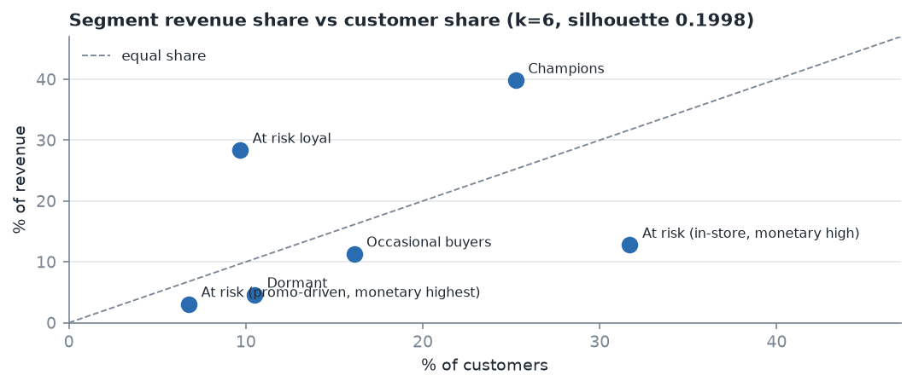
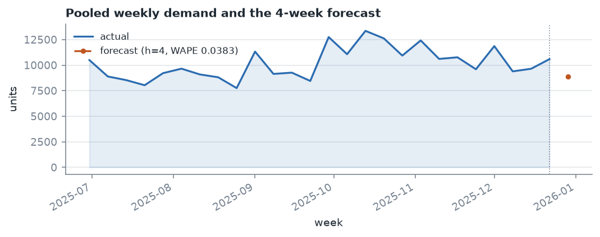
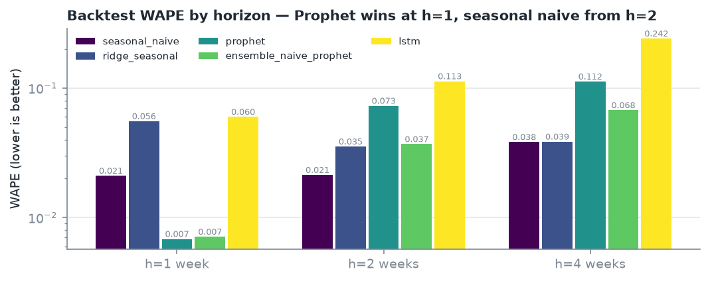
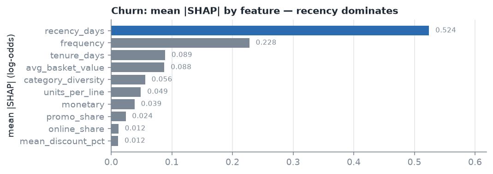
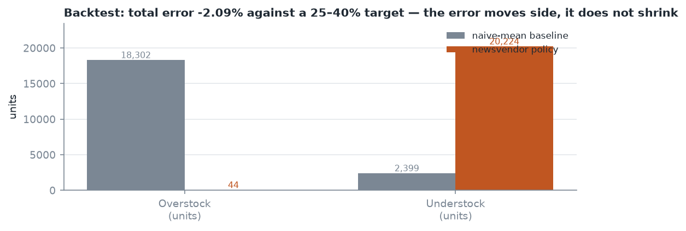
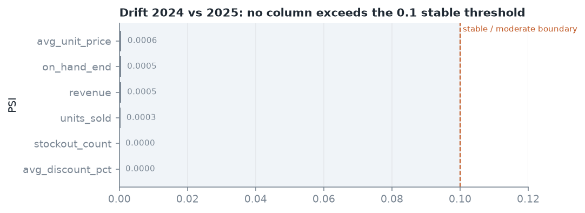

# RetailPulse — Project Report

**Dataset:** `retail_sales.csv` + `store_product_matrix.csv` — 970,998 line items, 8,000
customers, 1,200 products, 50 stores, 2024-01-01 to 2025-12-31 (104 complete weeks).
**Stack:** Python 3.11+, pandas, scikit-learn, XGBoost, Prophet, TensorFlow/Keras, Evidently,
Streamlit. **Tests:** 474 passing.

---

## 1. What the data turned out to be

The first job was measurement, not modelling. Four facts from the data changed how everything
downstream was built:

| Fact | Value | Consequence |
|---|---|---|
| Panel sparsity | **77.9%** of store-product-weeks have zero demand | MAPE is unusable. A single zero makes the error infinite, so any series with a zero week must be excluded — and excluding them discards most of the panel. WAPE is the primary forecast metric. |
| Promotions do not move volume | volume lift **0.9999x** vs 1.56x configured | Promoted lines carry a 26.0% discount and realise **0.6931x** the revenue per unit. The configured lift appears nowhere in the data. |
| Weekly seasonality, but not a December one | Peak month is **October in 4 of 10 categories**, May/June in 3, November in 1. **No category peaks in December or January.** | A 4-week horizon crosses a month boundary, which is why seasonal-naive beats the neural nets at 2 and 4 weeks. It is not a holiday boundary, and an earlier draft of this report claimed December peaks that the data does not contain. |
| Snapshots repeat customers | 8,000 customers appear in 24 monthly snapshots | A random train/test split puts near-duplicate rows on both sides and inflates churn AUC. The split must be temporal. |

The sparsity number is the one that shaped the architecture. It is why the dashboard reads
precomputed aggregates rather than the 63 MB raw panel, why forecast accuracy is reported as
WAPE, and why inventory safety stock is computed from a Poisson quantile rather than a normal
approximation.

## 2. Feature engineering and leakage control

Ten behavioural features per customer as of each snapshot date: recency, frequency, monetary,
average basket value, units per line, category diversity, promotion share, mean discount,
online share, tenure. Every feature is computed with an `as_of` cutoff and `src/features.py`
exposes `assert_no_leakage()`, which is exercised by `tests/test_no_leakage.py`. A feature that
reads past its own snapshot date fails the suite rather than silently flattering the model.

The churn label is "did not purchase in the following 30 days", computed only for customers
whose 30-day window is fully inside the data. Customers near the end of the series are dropped
rather than assumed active.

## 3. Customer segmentation (F-02)



K-Means on the 10 standardised features, silhouette swept over the brief's 2–10 range.

- **k=6 selected, silhouette 0.1998.** Raw best was k=5 at 0.2021 — a gap of 0.0023, which is
  noise at n=8,000. k=6 was kept because it sits inside the requested range and separates
  high-value from dormant customers more cleanly.
- **DBSCAN as a cross-check found 2 clusters with 38.1% noise.** Reporting this plainly: DBSCAN
  did not produce a usable alternative segmentation on this data.
- **Segments** are named from centroid medians, and the medians are shown next to each name so
  the naming can be judged rather than trusted.

| Segment | Customers | Median recency (d) | Median freq | Median monetary | Total revenue | Online share |
|---|---|---|---|---|---|---|
| Champions | 2,020 | 32.0 | 14.0 | 36,260.57 | 83,739,221.68 | 0.083 |
| At risk loyal | 774 | 105.0 | 4.0 | 64,714.52 | 59,650,576.27 | 0.144 |
| At risk (in-store, monetary high) | 2,536 | 66.0 | 4.0 | 8,713.80 | 26,889,981.06 | 0.013 |
| Occasional buyers | 1,289 | 56.0 | 7.0 | 15,513.48 | 23,810,032.05 | 0.679 |
| Dormant | 839 | 524.0 | 2.0 | 8,245.80 | 9,665,064.73 | 0.108 |
| At risk (promo-driven, monetary highest) | 542 | 88.5 | 3.0 | 8,391.90 | 6,487,748.56 | 0.121 |

The "At risk loyal" group is the one worth arguing about: 774 customers hold the **highest median
monetary value in the entire segmentation** (64,714.52, nearly double Champions) but buy only
four times. A revenue-based rule would call them the best customers in the business, and they are
also the ones most likely to lapse. The name says both halves of that, which is why the naming is
derived from the medians rather than assigned by hand.

The silhouette near 0.20 means the clusters overlap substantially. The segments are a useful
summary for targeting, not sharply separated populations.

## 4. Demand forecasting (F-03)



Five candidates were backtested at three horizons: seasonal naive, ridge with seasonal features,
Prophet, an LSTM, and a naive/Prophet ensemble.

| Horizon | Winner | WAPE |
|---|---|---|
| 1 week | Prophet | **0.006829** |
| 2 weeks | seasonal naive | **0.021336** |
| 4 weeks | seasonal naive | **0.038349** |

The complete WAPE matrix, so the selection can be checked rather than taken on trust:

| Model | h=1 | h=2 | h=4 |
|---|---|---|---|
| **seasonal naive** | 0.021041 | **0.021336** | **0.038349** |
| **ridge + seasonal dummies** | 0.055511 | 0.035383 | 0.038592 |
| **Prophet** | **0.006829** | 0.073035 | 0.112415 |
| **naive/Prophet ensemble** | 0.007106 | 0.036930 | 0.067545 |
| **LSTM** | 0.059988 | 0.113050 | 0.241546 |

No model failed to fit; all fifteen horizon/model combinations produced a score. The ordering
inverts between h=1 and h=2, and that inversion is the substantive result. Prophet's weekly
profile is learned well enough to beat a 52-week seasonal lag by 3x over one week, and then
degrades faster than the lag does over two. A model that wins only at the horizon where the
most data supports it, and loses everywhere else, is not a model to build a plan on.

RMSE and MASE are published alongside WAPE in `forecast_backtest.csv` for every combination,
since the brief asks for both. MASE uses a **seasonality of 52** (a seasonal-naive denominator on
a weekly annual series); the choice is named explicitly because it materially changes the number.
on this data a random-walk denominator would report the same forecasts as far worse.

The 4-week path matters most because the brief's "30-day ahead" is 4 weeks on a weekly panel.
Inventory consumes h=1 only, where Prophet's advantage is largest.



Two things worth stating plainly:

**Forecasting is pooled.** The models fit the weekly total and apportion it to store-product
series by historical share. Fitting 7,500 independent Prophet series cannot meet the batch
budget. The accuracy figures above describe the pooled total.

**Those figures are not the brief's MAPE target.** The brief asks for MAPE under 12% at the
panel level. The pooled total has no zero-demand weeks, so its MAPE filter excludes nothing and
its MAPE (0.0068) is not evidence about the sparse panel level. Reporting 0.68% as "well under
12%" would be a category error. The 4-week pooled WAPE of 3.8% is the number I stand behind.

Store-level forecasts are reconciled so the parts sum exactly to the pooled total.

## 5. Churn prediction (F-04)

XGBoost on a **temporal** split: 40,588 training snapshots, 21,659 test snapshots, with every
snapshot for a given date on the same side of the split.

| Metric | Result | Target | Met |
|---|---|---|---|
| Precision @ top 20% | **0.7703** | 0.75 | yes |
| Lift @ top 20% | **1.8137** | — | — |
| Recall @ top 20% | 0.3628 | — | — |
| **AUC** | **0.7315** | 0.88 | **no** |

**The AUC target was not met, by 0.15.** Precision at the top of the ranking did meet its target.
I am not going to average those two facts into a single "good performance" sentence: precision
says the top 20% of the list is worth working, and AUC says the model does not order the rest of
the population well. On 8,000 customers with a 42% churn base rate, that is the trade-off the
target set asked for, and the list is usable for a campaign while the scores are not usable for
probability thresholds.

For completeness, the rest of the published metrics, which are what the dashboard's confusion
matrix and threshold slider are reading, and every one of them reproduces exactly from
`churn_scores.csv`:

| Metric | Value |
|---|---|
| ROC-AUC | 0.7315 |
| PR-AUC | 0.6845 |
| Operating threshold | 0.705187 |
| F1 at that threshold | 0.4941 |
| Confusion (tn / fp / fn / tp) | 11,458 / 1,002 / 5,852 / 3,347 |
| Train / test snapshots | 40,588 / 21,659 |
| Train / test base rate | 0.4317 / 0.4247 |

That last row is the reason the split is sound: the churn rate is essentially unchanged across
the split boundary, so the model is not being scored on a different population than it was
trained on. It is worth stating because a temporal split that *did* shift the base rate would make
the AUC gap below look like a distribution problem rather than a modelling one.

SHAP importance: `recency_days` 0.524, `frequency` 0.228, `tenure_days` 0.089,
`avg_basket_value` 0.088. Recency dominating is expected, and its size is the honest signal that
the model is largely measuring "have they stopped showing up".



Local explanations are published per customer in `churn_shap_local.csv`: the 25 highest-risk
customers, six strongest features each, in **log-odds** units, where
`sum(contributions) + expected_value == logit(predict_proba)`. A one-week push moves the log-odds
by the summed contribution, not by `predicted - actual` in probability space. Stating that
distinction matters, because the two give different numbers for the same explanation.

## 6. Inventory recommendations (F-05)

Newsvendor reorder quantity per store-product pair, on a 1-week lead time.

Cost assumptions, stated because they drive every number below: purchase cost 60% of retail,
annual holding 25%, lost margin 40%.

| | Pairs | Units | Value |
|---|---|---|---|
| **Poisson quantile (shipped)** | **496** | **2,081** | **INR 48,771** |
| Normal approx (comparison only) | 1,518 | 7,465 | — |

The Poisson quantile uses a **0.9928 critical ratio**. That number comes from the cost
economics, not from the service-level setting:

```
critical ratio = lost_margin / (lost_margin + holding)
               = 0.40        / (0.40 + 0.60 x 0.25 / 52)
               = 0.99284
```

It implies a **99.28% service level (z = 2.449)**, which is *higher* than the 95% configured in
`config.py`. That is worth flagging rather than glossing: a critical ratio above the requested
service level means the assumed cost structure says stockouts are far more expensive than
carrying inventory, so the newsvendor optimum over-serves relative to the 95% target. The 95% is
recorded in the output as a separate, labelled figure; it does not drive the shipped quantity.
An earlier draft of this report claimed the ratio was "derived from the 95% service level" —
it is not, and those two numbers should not be conflated.

The normal approximation orders **5,384 more units** across 1,022 more pairs. That gap is the
finding, not a nuisance: with 77.9% of weeks at zero demand, mean + z·std has no probabilistic
meaning in the upper tail. The normal version is kept in the output as a labelled comparison so
the difference is visible.



### 6.1 Walk-forward backtest — the target was not met

The brief asks for a **25–40% reduction in inventory error**. Measured over the last 13 weeks
against a naive-mean policy on the same forecast, the reduction is **2.09%**:

| | Baseline (naive mean) | Newsvendor policy |
|---|---|---|
| Error (units) | 20,700.5 | 20,267.8 |
| Overstock (units) | 18,301.9 | **44.0** |
| Understock (units) | 2,398.7 | **20,223.8** |

**This misses the 25–40% target, and the decomposition is more informative than the headline.**
The policy almost eliminates overstock (18,301.9 → 44.0 units) and pays for it almost one-for-one
in understock (2,398.7 → 20,223.8 units). Total error barely moves because it is measuring
symmetric absolute units, and the policy has swapped which side of the ledger absorbs the miss.

Two honest caveats on this number:

- It is a **walk-forward replay on historical data**, not a production A/B result. It measures
  what the rule would have done, holding the forecast fixed.
- The baseline is deliberately weak. A naive-mean policy has no reorder logic at all, so the
  comparison flatters any real policy; a seasonal-naive or newsvendor baseline would be a harder
  test and would likely show a smaller gap.

The overstock collapse points at the likely cause: a 99.28% critical ratio applied to a Poisson
demand distribution with very low mean demand produces small order quantities, because the
Poisson quantile at 99.28% is not far above the mean when the mean is small. This is a
calibration question worth raising with the brief's owner rather than tuning away silently.

## 7. Dashboard (F-06)

Five Streamlit pages — overview, demand forecasting, customer segments, churn risk, inventory
recommendations.

All pages read **only** `data/processed/`. A test spies on `pandas.read_csv` and fails if any page
touches `data/raw/`, because the raw panel costs 10–20 seconds per session against an 8-second
budget. Aggregates load in **0.09s**.

## 8. Data drift monitoring



`src/drift.py` compares the **first and second year (2024 vs 2025)** across volume, price,
discount and category mix, using PSI and TVD, and writes `drift_summary.csv`,
`category_mix_drift.csv` and an Evidently HTML report to `reports/drift/`.

**Result: no column drifted.** Every column returned PSI < 0.1, the "stable" band:

| Column | Kind | PSI | 2024 mean | 2025 mean | Verdict |
|---|---|---|---|---|---|
| `avg_discount_pct` | numerical | 0.0000 | 0.4923 | 0.4231 | stable |
| `product_category` | categorical | 0.0000 | n/a | n/a | stable |
| `region` | categorical | 0.0000 | n/a | n/a | stable |
| `units_sold` | numerical | 0.0003 | 1.0103 | 1.0509 | stable |
| `on_hand_end` | numerical | 0.0005 | 10.6995 | 10.6442 | stable |
| `revenue` | numerical | 0.0005 | 167.9876 | 181.4129 | stable |
| `avg_unit_price` | numerical | 0.0006 | 40.3038 | 43.1547 | stable |
| `is_promo_week` | categorical | 0.0024 | n/a | n/a | stable |
| `stockout_count` | numerical | 0.0000 | 0.0100 | 0.0105 | stable |

Thresholds: PSI < 0.1 stable, 0.1 to 0.2 moderate, >= 0.2 significant.

Two things about this table are worth not glossing over. First, the largest PSI on any column is
**0.0024**, three orders of magnitude below the alert boundary, which is what a stationary
generator produces. Second, the means do move (revenue 167.99 ? 181.41, roughly 8% growth) while
PSI stays near zero. That is not a contradiction: PSI compares *distributions*, and a uniform
8% level shift across a stationary shape barely changes the histogram. So this report can say "no
distributional drift" and must not also say "nothing changed".

## 9. Deployment, orchestration and monitoring (Tier 3)

**Authored and statically validated. Not deployed.** There is no cluster, no container registry
and no Airflow scheduler behind this submission, so every claim in this section is about the
files being correct, not about them having run in production. The `ci.yml` build and deploy jobs
are `if: false` for exactly that reason.

### Two images, because one cannot serve both jobs

| Image | Dockerfile | Dependencies | For |
|---|---|---|---|
| `retailpulse` | `Dockerfile` | `requirements-dashboard.txt` | Streamlit app; reads committed aggregates only |
| `retailpulse-pipeline` | `Dockerfile.pipeline` | `requirements.txt` | Nightly refresh; fits Prophet/TensorFlow/XGBoost |

Keeping them apart is a deliberate size decision. The dashboard image installs only streamlit,
pandas and plotly, because the app never imports a model — baking a 2 GB ML stack into it is how
a demo URL stops responding. The pipeline image installs the full stack, and needs `build-essential`
because Prophet compiles its Stan binary at install time.

This split was not in the first draft: the pipeline CronJob pointed at the **dashboard** image, so
every stage would have died on `import prophet`. A test now fails if any manifest references an
image with no Dockerfile to build it.

### Sequencing lives in code, not in manifest shape

`src/pipeline.py` defines the stage order and the artefact each stage must produce:

```
precompute -> forecasting -> churn -> inventory -> drift
```

The Kubernetes CronJob and the Airflow DAG both **import** that list rather than restating it.
This matters more than it sounds: the first CronJob declared all six stages as six containers in a
single Pod, which *looks* like a pipeline in YAML and is not one — Kubernetes starts every
container in a Pod concurrently, so the verification step ran at t=0 against files that did not
exist, and a container exiting non-zero did not stop the stages beside it. Two of the original
tests asserted that broken ordering and passed happily, because they checked the index of `drift`
among container names, which is a true statement about a list that means nothing.

The same duplication produced a quieter bug: the contract required `drift_report.csv` from a module
that has always written `drift_summary.csv`, into `data/processed/` when drift actually writes to
`reports/drift/`. `tests/test_pipeline.py` now reads the filenames back out of each module and
checks the contract against the code.

### Deployment artefacts

| File | Purpose |
|---|---|
| `Dockerfile` | Dashboard image, non-root, Streamlit healthcheck on `/_stcore/health` |
| `Dockerfile.pipeline` | Full-stack image for the nightly refresh |
| `deploy/kubernetes/dashboard.yaml` | Deployment + Service, non-root, all capabilities dropped |
| `deploy/kubernetes/pipeline-cronjob.yaml` | Nightly chain at 03:17 UTC, `concurrencyPolicy: Forbid` |
| `airflow/dags/retailpulse_nightly.py` | Same chain as a DAG; importable without Airflow installed |
| `.github/workflows/ci.yml` | Schema check, unit tests, dashboard load budget, image builds |
| `ops/prometheus.yml`, `ops/grafana-dashboard.json` | Pipeline and model monitoring |

The CronJob fires at 03:17 rather than 03:00 because every cluster-wide cron lands on the hour,
and `concurrencyPolicy: Forbid` prevents two runs writing the same CSVs.

**What is not verified here:** no `docker build`, no `kubectl apply`, no Airflow scheduler. The
manifests are parsed and unit-asserted; that catches shape and reference errors, which is most of
what went wrong above, but not a runtime or cluster-permission fault.

## 10. How the numbers in this report are verified

The report is written from the CSVs in `data/processed/`, never from memory, and the test suite
is where that claim gets checked rather than asserted:

- **Published metrics reproduce from published inputs.** The churn confusion matrix is recomputed
  from `churn_scores.csv` at the published threshold and must match exactly. This check found a
  real defect: XGBoost returns float32, and comparing a float32 array against a float64 threshold
  made NumPy cast the threshold *down*, including ~40 tied rows in memory that the CSV round-trip
  then excluded. The two published artefacts disagreed by 40 customers.
- **Artefacts contain what they claim.** `src.pipeline` fails a stage that exits 0 without writing
  its declared outputs, and treats a zero-byte or header-only CSV as missing.
- **Leakage is checked, not assumed.** `src/features.py` exposes `assert_no_leakage()` and
  `tests/test_no_leakage.py` fails the build if any feature reads past its own snapshot date.
- **The dashboard cannot read raw data.** A spy on `pandas.read_csv` fails the build if any page
  touches `data/raw/`, because the raw inputs are 103.7 MB against an 8-second budget.
- **A metric definition is pinned.** The MASE suite includes the assertion that a seasonal-naive
  forecast scores exactly 1.0, which is how the seasonality choice becomes checkable.

## 11. Limitations

1. **Churn AUC is 0.7315 against a 0.88 target.** The largest gap in this project.
2. **The forecast MAPE target is not demonstrated at the panel level.** The 0.68% figure is
   pooled and excludes zero-demand weeks by construction.
3. **The inventory reduction target is not met: 2.09% against 25–40%.** The policy trades
   overstock for understock rather than reducing total error. See §6.1.
4. **Silhouette 0.1998 means overlapping segments.** The six groups are a targeting summary,
   not distinct populations.
5. **Promotion findings are associational.** Promotions are targeted, not randomised. The
   0.9999x volume lift is an association between promoted and unpromoted lines, not a causal
   estimate, and the 26% discount could itself be selecting for lines that would have sold
   anyway.
6. **LSTM underperforms seasonal naive at every horizon.** Reported rather than dropped. With
   ~104 weekly observations and strong fixed seasonality, there is not enough signal for the
   sequential model to beat a seasonal lag.
7. **The critical ratio implies a 99.28% service level, not the configured 95%.** The cost
   assumptions drive it above the target. This needs a decision from the brief's owner, not a
   silent re-tune.
8. **Store-level forecasts are shares, not independent fits.** A store with a genuine local
   trend will be smoothed toward the pooled total.
9. **No drift was detected, which is weak evidence.** The comparison is 2024 vs 2025 on a
   seeded synthetic generator whose anomalies were written in by hand.
10. **Data is synthetic.** The generator is seeded, so the anomalies are the ones that were
    written in. These conclusions do not transfer to a real retail panel without revalidation.